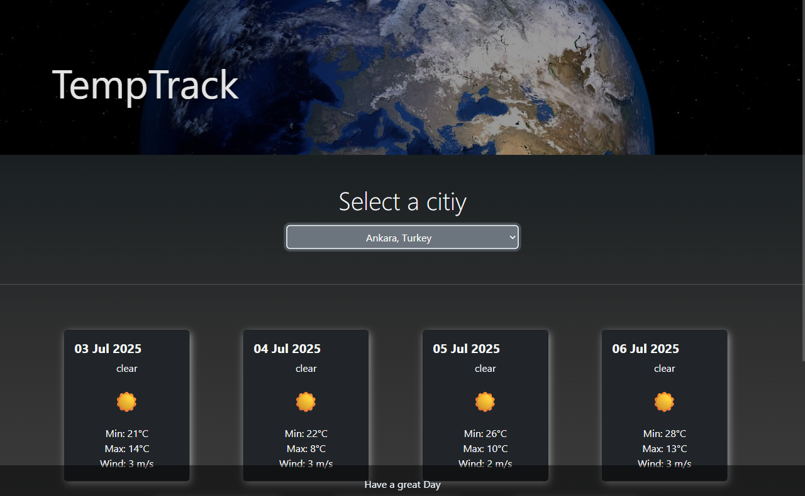

# 🌤️ TempTrack - Weather Forecast App

TempTrack is a sleek and responsive web-based weather application that allows users to select a city and instantly view upcoming weather forecasts in an elegant UI.

## 🔍 Preview



## 🌐 Live Demo

> 👉 [Click here to try it live](https://temperaturetracker.netlify.app/) 

---

## 📂 Project Structure

```bash
Weather App/
│
├── index.html        # Main HTML structure
├── styles.css        # Styling and responsiveness
├── script.js         # Core JavaScript logic (API handling, DOM manipulation)
├── banner.jpg        # Hero banner image
└── README.md         # Project documentation
